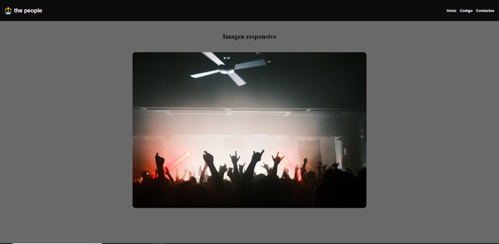
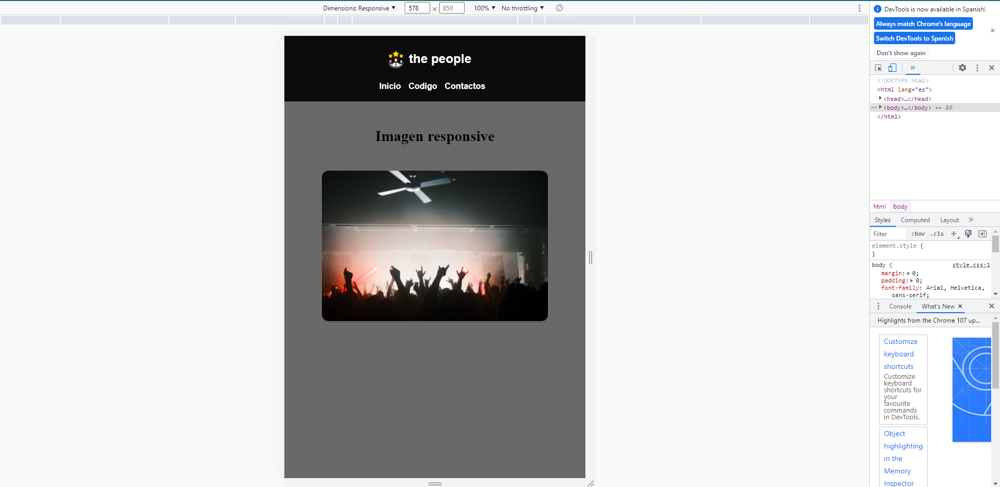

<h1> 
welcome to the responsive menu repository
</h1>
<h4> can you see the website here ψ(._. )>
</h4>
<a  href="https://mimenubasico-responsive.netlify.app/" target="_blank" > the website
</a>
<a href="https://mimenubasico-responsive.netlify.app/"> the website </a>

<h2>
Now we have the menu and the image adding the changes in css with the use of the   property
display flex
</h2>

<h3>
